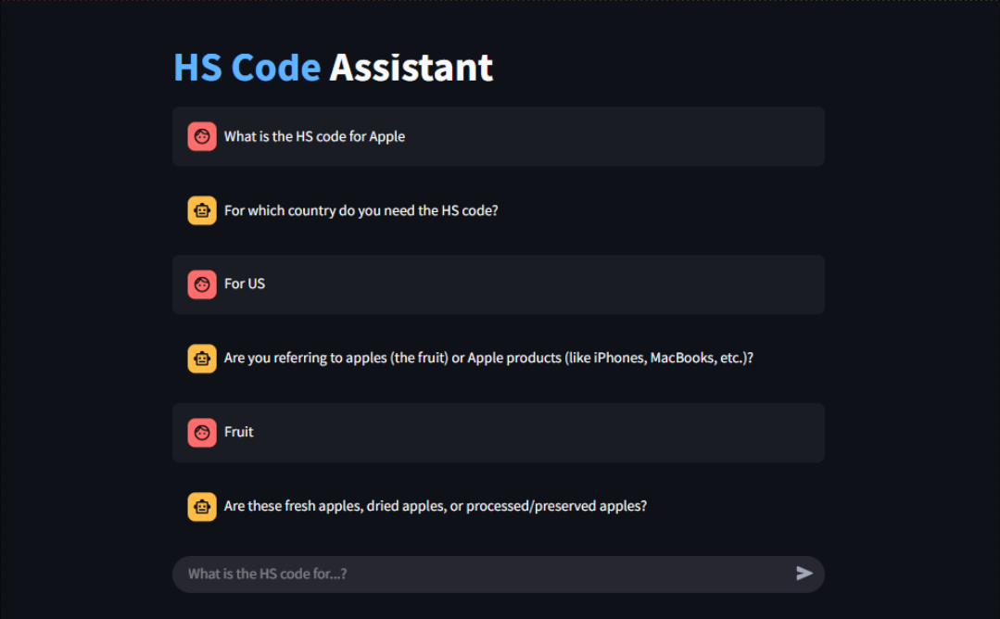

# HS Code Assistant Chatbot

This project implements a Streamlit-based chatbot designed to help users find suggested 10-digit Harmonized System (HS) codes for various products in specific countries. It uses the Deepseek API. The chatbot asks clarifying questions to narrow down product details and suggests potential HS codes in real-time.



## Features

*   Interactive chat interface using Streamlit.
*   Natural language interaction.
*   Asks follow-up questions to disambiguate product descriptions.
*   Requires target country information.
*   Suggests 10-digit HS codes once the product is specific enough.
*   Real-time streaming of chatbot responses.

## How it Works

1.  **System Prompt:** A detailed system prompt guides the Deepseek model on its role, goal, and instructions.
2.  **Conversation History:** The chatbot maintains the history of the conversation (user inputs and bot responses) using Streamlit's session state.
3.  **Deepseek API with Streaming:** Each user input, along with the entire conversation history, is sent to the Deepseek API with the `stream=True` parameter.
4.  **LLM Reasoning:** The language model analyzes the conversation to:
    *   Determine if the product description is specific enough.
    *   Check if the target country is known.
    *   Generate a relevant clarifying question if needed.
    *   Suggest a plausible 10-digit HS code if the product is sufficiently detailed.

## Setup

1. **Create a virtual environment (recommended):**
    ```bash
    python -m venv venv
    source venv/bin/activate  # On Windows use `venv\Scripts\activate`
    ```
2.  **Install dependencies:**
    ```bash
    pip install -r requirements.txt
    ```

## Running the Chatbot

Execute the Streamlit app from your terminal:

```bash
streamlit run src/hs_code_chatbot/interface.py
```